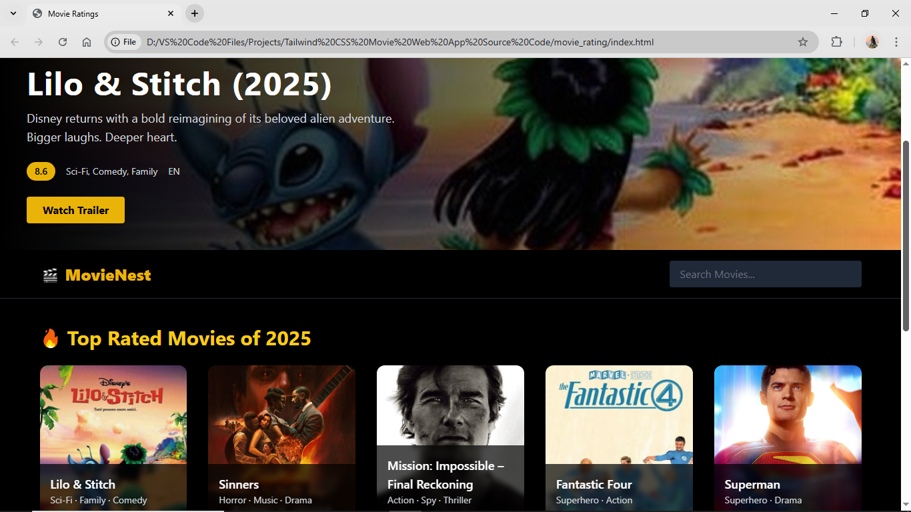

# 🎬 MovieNest – 2025 Movie Ratings Website

**MovieNest** is a visually engaging, responsive movie ratings website built with **HTML** and **Tailwind CSS**. It showcases the top-rated films of 2025 with a sleek, dark-themed UI and interactive components.

---

## 🌟 Features

- 🎥 Hero section highlighting a featured 2025 movie
- 🖼 Modern movie cards with hover animations
- 🌌 Dark-themed, fully responsive layout
- ⭐ Star-based rating display
- 📱 Mobile-friendly grid layout
- 🔍 Styled search bar UI (placeholder)

---

## 🛠 Tech Stack

- **HTML5**
- **Tailwind CSS** (via CDN)
- **Custom CSS** (`style/style.css`)

---

## 📁 Folder Structure

```
movie_rating/
├── assets/
│   ├── lilo_stitch.jpg
│   ├── sinners.jpg
│   ├── superman.jpg
│   ├── mission_impossible.jpg
│   ├── fantastic_four.jpg
│   ├── f1_movie.jpg
│   ├── star.png
│   └── screenshot-home.png
├── style/
│   └── style.css
├── index.html
└── README.md
```

---

## 🚀 Getting Started

To view the site locally:

1. Clone or download this repository.
2. Open `index.html` in any web browser.
3. Make sure the `assets/` folder contains all required images.

> No frameworks or build steps needed — it's a static, ready-to-run site.

---

## 🎞 Screenshot



> Make sure `screenshot-home.png` is in the `assets/` folder.

---

## 🔧 Customization Tips

- Update movie posters or add your own inside `/assets/`.
- Modify or expand movie cards in the `<main>` section.
- Add filters, pagination, or modal trailers for more interactivity.

---

## 📜 License

This project is free to use for educational and personal purposes.  
Please do not redistribute for commercial purposes without permission.

---

## 📬 Contact

For suggestions, improvements, or collaboration, feel free to reach out or fork the project and make it your own!
